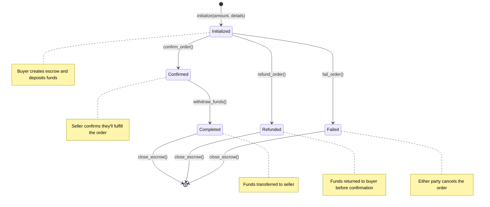

# Solana Escrow Program

## Overview

The Solana Escrow Program is a smart contract that facilitates the secure exchange of assets between a buyer and a seller. It ensures that the buyer's funds are held in escrow until the seller fulfills their part of the agreement. The program allows for the following states:

