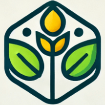

# TaniTrack Agrichain

[](https://x.com/tanitracks)
[](https://www.linkedin.com/in/tanitrack-supply-chain-and-digital-marketplace-solution-060933361)
[](https://agrichain.pages.dev/)

<div align="center">
  
</div>

**Secure, efficient, and transparent supply chain and digital marketplace solution for farmers and consumers.**

TaniTrack Agrichain aims to revolutionize the agricultural ecosystem by directly connecting farmers with buyers. We leverage a hybrid Web2.5 approach, combining a seamless user experience with the robust security of blockchain technology for financial transactions. Our goal is to increase farmer welfare and improve the overall efficiency and transparency of agricultural trade.


_Note: This is a placeholder for a more representative screenshot of the platform._

## Table of Contents

- [Key Features](#key-features)
- [Technology Stack](#technology-stack)
- [Architecture Overview](#architecture-overview)
- [Getting Started](#getting-started)
  - [Prerequisites](#prerequisites)
  - [Installation](#installation)
  - [Environment Setup](#environment-setup)
  - [Running the Application](#running-the-application)
- [Project Structure](#project-structure)
  - [Solana Program (`anchor`)](#solana-program-anchor)
  - [Web Application (`web`)](#web-application-web)
- [Core Flows](#core-flows)
- [Testing](#testing)
- [Contributing](#contributing)
- [License](#license)

## Key Features

- **Farmer Onboarding:** Easy registration and profile management for farmers.
- **Commodity Marketplace:**
  - Farmers can list agricultural products with detailed information (grade, stock, price, bulk pricing).
  - Buyers can browse, search, and filter commodities.
- **Order Book System:** Buyers can post specific commodity requests for farmers to fulfill.
- **Secure Transactions via Solana Escrow:** On-chain escrow smart contract ensures financial integrity and trust between parties.
- **Hybrid Off-chain/On-chain Data Management:**
  - **Convex (Off-chain):** Manages user profiles, commodity listings, order details, and real-time application state.
  - **Solana (On-chain):** Handles secure fund escrow and transaction settlement.
- **Simplified Web3 Experience:** Dynamic.xyz provides embedded wallets and abstracts blockchain complexities for users.
- **Commodity Price Dashboard:** Real-time market prices, trends, and regional comparisons.
- **Traceability:** QR code integration for tracking commodity origin and transaction history (planned).
- **Shipping Management:** Tools for managing the logistics of commodity delivery (basic implementation).
- **User-Friendly Interface:** Intuitive UI for both farmers and buyers, with i18n support (English & Indonesian).

## Technology Stack

- **Frontend:** React, Vite, TypeScript, Shadcn/UI, Tailwind CSS, nuqs state management
- **Off-Chain Backend (BaaS):** Convex (Real-time Database, Serverless Functions)
- **Blockchain:** Solana
- **Smart Contract Framework:** Anchor (Rust)
- **Authentication & Wallet Abstraction:** Dynamic.xyz
- **Deployment:** Cloudflare Pages (Frontend), Convex Cloud (Backend)

## Architecture Overview

TaniTrack employs a **hybrid Web2.5 architecture**:

- **Web2 (Convex & Frontend):** Handles the majority of application logic, user data, listings, off-chain order status, and provides a fast, real-time user experience.
- **Web3 (Solana & Dynamic.xyz):** Secures financial transactions through an on-chain escrow smart contract and manages user cryptographic keys/wallets via Dynamic.xyz's embedded wallet solution.

This approach combines the ease of development and rich UX of Web2 technologies with the security and transparency of Web3 for critical financial interactions.

For a more detailed look at the architecture and transaction flows, please see:

- [Technical Slides](./documentations/TECH-SLIDES.md)
- [Order & Transaction Flows](./documentations/ORDER_TRANSACTION_FLOWS.md)

## Getting Started

### Prerequisites

Ensure you have the following installed:

- Node.js: v18.18.0 or higher
- pnpm: (Recommended package manager) `npm install -g pnpm`
- Vite: v5.4.18 or higher (comes with project dependencies)
- Rust: v1.77.2 or higher
- Anchor CLI: v0.31.1 or higher
- Solana CLI: v1.18.17 or higher

### Installation

1.  **Clone the repository:**

    ```shell
    git clone https://github.com/tanitrack/agrichain.git
    cd agrichain
    ```

2.  **Install dependencies:**
    ```shell
    pnpm install
    ```

### Environment Setup

1.  Copy the example environment file:
    ```shell
    cp .env.local.example .env.local
    ```
2.  Open `.env.local` and fill in the required environment variables:
    - `CONVEX_DEPLOYMENT`: Your Convex deployment URL (from `npx convex deploy` or Convex dashboard).
    - `VITE_CONVEX_URL`: Your Convex project URL.
    - `VITE_CONVEX_SITE_URL`: The base URL for your Convex deployment (often `VITE_CONVEX_URL` with `.cloud` replaced by `.site`).
    - `VITE_DYNAMIC_ENVIRONMENT_ID`: Your Environment ID from Dynamic.xyz.
    - (Optional) `VITE_SOLANA_RPC_URL`: If you want to override the default Solana RPC endpoint.

### Running the Application

1.  **Deploy/Link your Convex backend:**
    If this is your first time or you've pulled new backend changes:

    ```shell
    npx convex deploy
    ```

    (Or link to an existing Convex project with `npx convex link`)

2.  **Start the development servers:**
    This command will start the Vite frontend development server and the Convex backend development server concurrently.
    ```shell
    pnpm dev
    ```
    - Frontend will typically be available at `http://localhost:8080`.
    - Convex dashboard will be available at the URL output by `convex dev`.

## Project Structure

The project is organized into two main parts:

### Solana Program (`anchor`)

Located in the `programs/agrichain/` directory. This is the Solana smart contract written in Rust using the Anchor framework, responsible for the on-chain escrow logic.

**Key Commands (run from the root directory):**

- **Build the program:**
  ```shell
  anchor build
  ```
- **Deploy the program:**
  ```shell
  anchor deploy
  ```
- **Test the program:**
  ```shell
  anchor test
  ```
- **Sync Program ID:** After deploying or generating a new keypair for the program, run:
  ```shell
  anchor sync
  ```
  This updates the program ID in `Anchor.toml` and the `declare_id!` macro in `programs/agrichain/src/lib.rs`.

### Web Application (`web`)

Located primarily in the `src/` directory. This is a React application built with Vite.

**Key Directories:**

- `src/components/`: Reusable UI components.
- `src/pages/`: Top-level page components for different routes.
- `src/contexts/`: React context providers (e.g., Language, Auth).
- `src/hooks/`: Custom React hooks.
- `src/lib/`: Utility functions, Solana library integrations, Convex API client.
- `convex/`: Convex backend functions (queries, mutations, actions) and schema.

**Key Commands (run from the root directory):**

- **Start frontend development server:** (Usually done via `pnpm dev`)
  ```shell
  pnpm dev:frontend
  ```
- **Build for production:**
  ```shell
  pnpm build
  ```
- **Lint and Format:**
  ```shell
  pnpm lint
  pnpm format
  ```

## Core Flows

- **Authentication:** Managed by Dynamic.xyz, with Convex handling backend session verification. See [AUTH_PLANNING.md](./documentations/AUTH_PLANNING.md).
- **Order & Escrow:** A hybrid flow utilizing Convex for off-chain order management and Solana for on-chain fund escrow. See [ORDER_TRANSACTION_FLOWS.MD](./documentations/ORDER_TRANSACTION_FLOWS.md) and [ESCROW_PROGRAM.MD](./documentations/ESCROW_PROGRAM.md).

## Testing

- **Solana Program Tests:**
  Located in `tests/escrow.spec.ts`. Run using:

  ```shell
  anchor test
  ```

  (Ensure your local Solana validator is running, e.g., `solana-test-validator`)

## Contributing

We welcome contributions! Open an issue or submit a pull request for any improvements, bug fixes, or new features.

## License

Licensed under the [Apache License 2.0](https://www.apache.org/licenses/LICENSE-2.0). See the [LICENSE](./LICENSE) file for details.

---

Thank you for your interest in TaniTrack Agrichain!
