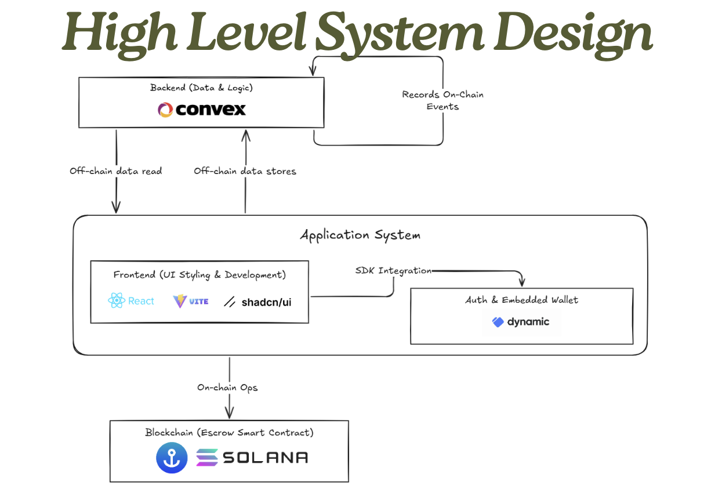

# TaniTrack 


[](https://x.com/tanitracks)
[](https://www.linkedin.com/in/tanitrack-supply-chain-and-digital-marketplace-solution-060933361)
[](https://agrichain.pages.dev/)

Secure, efficient, trustless supply chain and digital
marketplace solution for both farmers and consumers

## Key Platform
Increase Farmer’s Welfare
and Improve Agriculture Ecosystems
in Indonesia or Even the WORLD to the NEXT level!

## Key Features
- Farmers Onboarding
- Supply Chain (Commodity listing, OB, Transaction, and shipping)
- Commodities Price Dashboard
- Traceability (QR Code scan)


## Getting Started
### Prerequisites

- Node v18.18.0 or higher
- Vite v5.4.18 
- Rust v1.77.2 or higher
- Anchor CLI 0.31.1 or higher
- Solana CLI 1.18.17 or higher


### Installation

#### Clone the repo

```shell
git clone https://github.com/tanitrack/agrichain.git
cd agrichain
```

#### Install Dependencies

```shell
pnpm install
```

#### Start the web app

```shell
pnpm dev
```

## Apps

### anchor

This is a Solana program written in Rust using the Anchor framework.

#### Commands

You can use any normal anchor commands.

#### Sync the program id

Running this command will create a new keypair in the `target/deploy` directory and save the address to the
Anchor config file and update the `declare_id!` macro in the `programs/src/lib.rs` file of the program.

### web

This is a React app that uses the Anchor generated client to interact with the Solana program.

#### Commands

Start the web app

```shell
pnpm dev
```

Build the web app

```shell
pnpm build
```
