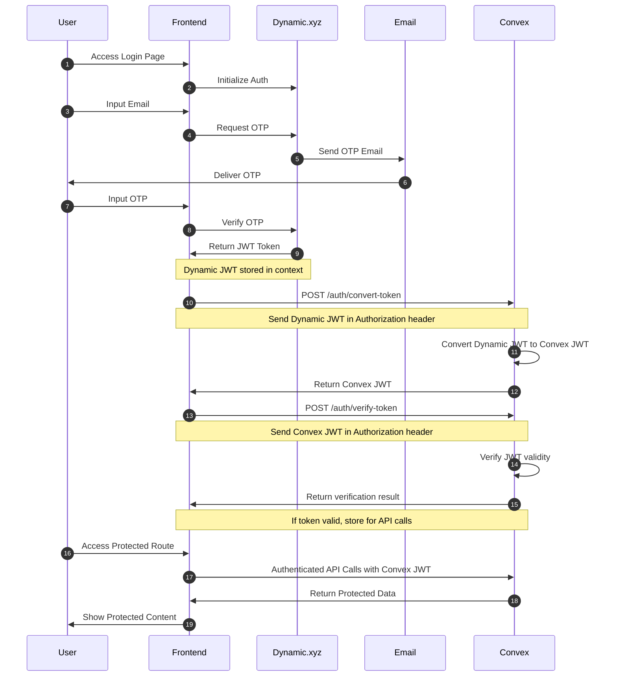
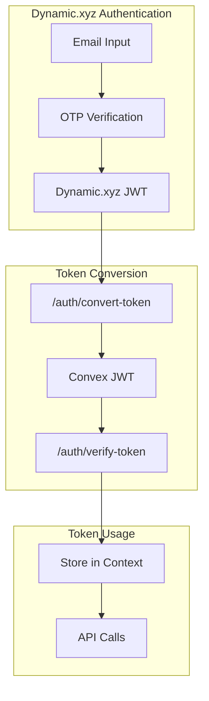
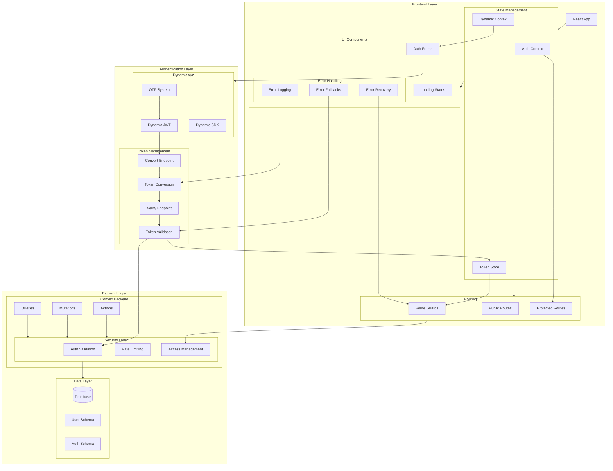

# Dynamic.xyz and Convex Authentication Implementation

## Table of Contents

1. [Overview](#overview)
   - [Authentication Flow](#authentication-flow)
   - [Token Flow](#token-flow)
   - [System Components](#system-components)
2. [Core Implementation](#core-implementation)
   - [Provider Setup](#provider-setup)
   - [Authentication Hooks](#authentication-hooks)
   - [Protected Routes](#protected-routes)
   - [Token Management](#token-management)
   - [Error Handling](#error-handling)

## Overview

### Authentication Flow

<!-- Authentication Flow Diagram -->



The authentication process follows these steps:

1. User initiates login by accessing the login page
2. User provides their email address
3. Dynamic.xyz sends an OTP to the user's email
4. User receives the OTP in their email
5. User enters the OTP in the login page
6. Upon successful OTP verification:
   - Dynamic.xyz provides a JWT token
   - Token is stored in Dynamic context
7. Convex authentication process:
   - Frontend sends Dynamic JWT to `/auth/convert-token` endpoint
   - Convex converts Dynamic JWT to Convex JWT
   - Frontend verifies Convex JWT using `/auth/verify-token` endpoint
   - Valid Convex JWT is stored for API calls
8. Protected route access:
   - Frontend includes Convex JWT in Authorization header
   - Convex validates token for each request
   - Protected data is returned only for valid tokens

### Token Flow



### System Components

<!-- System Components Diagram -->



Key Components:

1. Frontend Layer:

   - React application with comprehensive state management
   - Protected and public routing with route guards
   - Authentication forms and UI components
   - Robust error handling system:
     - Error logging for token conversion/verification
     - Fallback UI for authentication failures
     - Error recovery mechanisms

2. Authentication Layer:

   - Dynamic.xyz integration:
     - OTP-based authentication
     - JWT token management
     - SDK integration
   - Token management:
     - `/auth/convert-token` endpoint
     - `/auth/verify-token` endpoint
     - Token conversion and validation logic

3. Backend Layer:
   - Convex Backend:
     - Protected queries and mutations
     - Authentication actions
     - Security layer:
       - Token validation
       - Rate limiting
       - Access management
   - Data Layer:
     - User and authentication schemas
     - Secure data access patterns

## Core Implementation

### Provider Setup

```typescript
// src/providers/auth-provider.tsx
import { DynamicContextProvider } from '@dynamic-labs/sdk-react-core';
import { ConvexProviderWithAuth } from 'convex/react';
import { ReactNode } from 'react';
import { useAuthFromDynamic } from '@/hooks/use-auth-from-dynamic';

interface AuthProviderProps {
  children: ReactNode;
  convex: ConvexReactClient;
}

export function AuthProvider({ children, convex }: AuthProviderProps) {
  return (
    <DynamicContextProvider
      settings={{
        environmentId: import.meta.env.VITE_DYNAMIC_ENVIRONMENT_ID,
        walletConnectors: [],
      }}
    >
      <ConvexProviderWithAuth client={convex} useAuth={useAuthFromDynamic}>
        {children}
      </ConvexProviderWithAuth>
    </DynamicContextProvider>
  );
}
```

### Authentication Hooks

```typescript
// src/hooks/use-auth-from-dynamic.ts
import { getAuthToken, useDynamicContext, useIsLoggedIn } from '@dynamic-labs/sdk-react-core';
import { useCallback, useMemo } from 'react';

export function useAuthFromDynamic() {
  const { sdkHasLoaded, handleLogOut } = useDynamicContext();
  const isLoggedIn = useIsLoggedIn();
  const dynamicJwtToken = getAuthToken();

  const fetchAccessToken = useCallback(
    async ({ forceRefreshToken }: { forceRefreshToken?: boolean } = {}) => {
      if (!isLoggedIn) return null;

      try {
        // Convert Dynamic JWT to Convex JWT
        const { token } = await fetch(
          `${import.meta.env.VITE_CONVEX_URL.replace('.cloud', '.site')}/auth/convert-token`,
          {
            method: 'POST',
            headers: {
              'Content-Type': 'application/json',
              Authorization: `Bearer ${dynamicJwtToken}`,
            },
          }
        ).then((r) => r.json());

        // Verify the converted token
        const { valid } = await fetch(
          `${import.meta.env.VITE_CONVEX_URL.replace('.cloud', '.site')}/auth/verify-token`,
          {
            method: 'POST',
            headers: {
              'Content-Type': 'application/json',
              Authorization: `Bearer ${token}`,
            },
          }
        ).then((r) => r.json());

        return token && valid ? token : null;
      } catch (error) {
        console.error('Token conversion/verification failed:', error);
        return null;
      }
    },
    [isLoggedIn, dynamicJwtToken]
  );

  return useMemo(
    () => ({
      isLoading: !sdkHasLoaded,
      isAuthenticated: !!dynamicJwtToken,
      fetchAccessToken,
      onLogout: handleLogOut,
    }),
    [sdkHasLoaded, dynamicJwtToken, fetchAccessToken, handleLogOut]
  );
}
```

### Protected Routes

```typescript
// src/components/auth/protected-route.tsx
import { useNavigate } from 'react-router-dom';
import { useDynamicContext, useIsLoggedIn } from '@dynamic-labs/sdk-react-core';
import { useEffect } from 'react';
import { Spinner } from '@/components/ui/spinner';

interface ProtectedRouteProps {
  children: React.ReactNode;
  fallback?: React.ReactNode;
  redirectTo?: string;
}

export function ProtectedRoute({
  children,
  fallback = <Spinner />,
  redirectTo = '/login'
}: ProtectedRouteProps) {
  const isLoggedIn = useIsLoggedIn();
  const { sdkHasLoaded, handleLogOut } = useDynamicContext();
  const navigate = useNavigate();

  useEffect(() => {
    if (!isLoggedIn && sdkHasLoaded) {
      handleLogOut().then(() => navigate(redirectTo));
    }
  }, [isLoggedIn, handleLogOut, navigate, sdkHasLoaded, redirectTo]);

  if (!sdkHasLoaded) {
    return (
      <div className="flex h-screen items-center justify-center">
        {fallback}
      </div>
    );
  }

  if (!isLoggedIn) {
    return null;
  }

  return <>{children}</>;
}
```

### Token Management

```typescript
// src/lib/token-manager.ts
import { getAuthToken } from '@dynamic-labs/sdk-react-core';

export class TokenManager {
  private static instance: TokenManager;
  private convexToken: string | null = null;

  private constructor() {}

  static getInstance(): TokenManager {
    if (!TokenManager.instance) {
      TokenManager.instance = new TokenManager();
    }
    return TokenManager.instance;
  }

  async convertToken(): Promise<string | null> {
    const dynamicToken = getAuthToken();
    if (!dynamicToken) return null;

    try {
      const { token } = await fetch(
        `${import.meta.env.VITE_CONVEX_URL.replace('.cloud', '.site')}/auth/convert-token`,
        {
          method: 'POST',
          headers: {
            'Content-Type': 'application/json',
            Authorization: `Bearer ${dynamicToken}`,
          },
        }
      ).then((r) => r.json());

      this.convexToken = token;
      return token;
    } catch (error) {
      console.error('Token conversion failed:', error);
      return null;
    }
  }

  async verifyToken(token: string): Promise<boolean> {
    try {
      const { valid } = await fetch(
        `${import.meta.env.VITE_CONVEX_URL.replace('.cloud', '.site')}/auth/verify-token`,
        {
          method: 'POST',
          headers: {
            'Content-Type': 'application/json',
            Authorization: `Bearer ${token}`,
          },
        }
      ).then((r) => r.json());

      return valid;
    } catch (error) {
      console.error('Token verification failed:', error);
      return false;
    }
  }

  getConvexToken(): string | null {
    return this.convexToken;
  }

  clearTokens(): void {
    this.convexToken = null;
  }
}
```

### Error Handling

```typescript
// src/lib/error-handler.ts
export class AuthError extends Error {
  constructor(
    message: string,
    public readonly code: string,
    public readonly originalError?: unknown
  ) {
    super(message);
    this.name = 'AuthError';
  }
}

export function handleAuthError(error: unknown): AuthError {
  if (error instanceof AuthError) {
    return error;
  }

  if (error instanceof Error) {
    return new AuthError(error.message, 'UNKNOWN_ERROR', error);
  }

  return new AuthError('An unknown error occurred', 'UNKNOWN_ERROR', error);
}

// Usage in components
try {
  await tokenManager.convertToken();
} catch (error) {
  const authError = handleAuthError(error);
  console.error(authError);
  // Handle specific error cases
  switch (authError.code) {
    case 'TOKEN_CONVERSION_FAILED':
      // Handle token conversion failure
      break;
    case 'TOKEN_VERIFICATION_FAILED':
      // Handle token verification failure
      break;
    default:
      // Handle unknown errors
      break;
  }
}
```
