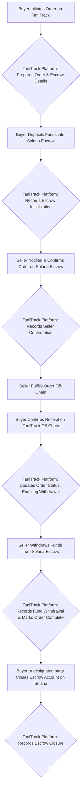
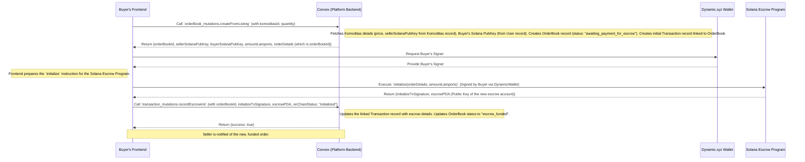
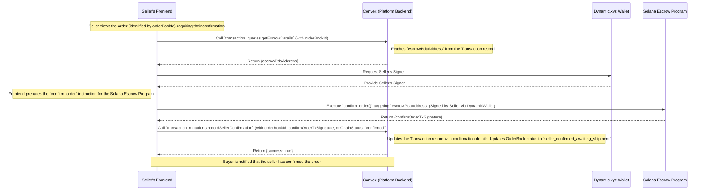
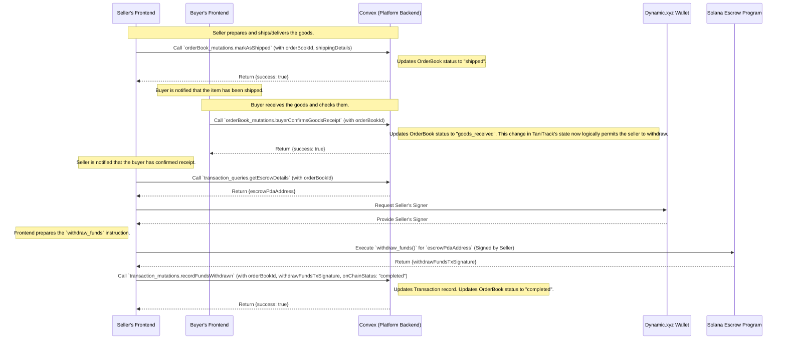
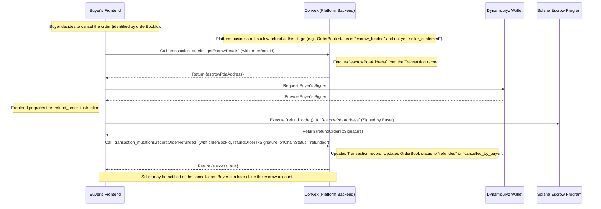
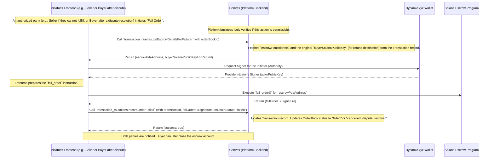
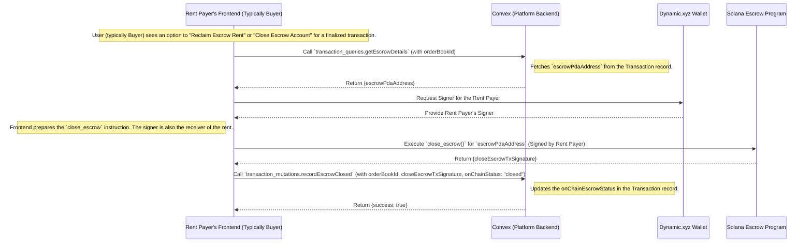

# TaniTrack: Escrow and Ordering Flow Documentation

## 1. Introduction

This document outlines the end-to-end flow for handling orders and financial transactions using the integrated Solana escrow system within the TaniTrack platform. The system is designed to ensure secure and transparent dealings between buyers and sellers, with the TaniTrack platform (Convex backend and frontend) orchestrating off-chain state management and user interactions, while the Solana blockchain handles the secure escrow of funds.

The `orderDetails` for on-chain escrow transactions will typically be the `orderBook._id` from the TaniTrack Convex database, linking the on-chain activity to the specific off-chain agreement.

## 2. High-Level Escrow/Ordering Flow Overview

The following diagram provides a general overview of the main phases involved in a typical transaction:

**Explanation of High-Level Phases:**

1. **Order Initiation (Buyer):** A buyer decides to purchase a listed commodity or posts an order request through the TaniTrack frontend.
2. **Platform Preparation:** The TaniTrack backend (Convex) creates an off-chain record of the order (`OrderBook`) and prepares the necessary details for the on-chain escrow (seller's wallet address, total amount, unique order identifier).
3. **Escrow Funding (Buyer):** The buyer uses their connected Solana wallet (facilitated by Dynamic.xyz) to transfer the agreed amount into a new, unique Solana escrow account created for this specific transaction.
4. **Platform Records Funding:** TaniTrack's backend records the successful on-chain escrow initialization, including the Solana transaction hash and the escrow account's address. The order status is updated (e.g., "Escrow Funded").
5. **Order Confirmation (Seller):** The seller is notified of the funded order. They review it and use their Solana wallet to confirm their commitment to fulfill the order by interacting with the on-chain escrow contract.
6. **Platform Records Confirmation:** The backend updates the order status to reflect the seller's on-chain confirmation (e.g., "Seller Confirmed, Awaiting Shipment").
7. **Fulfillment (Seller - Off-Chain):** The seller prepares and ships/delivers the agricultural products to the buyer. This is an off-chain process, but its status is updated within TaniTrack.
8. **Receipt Confirmation (Buyer - Off-Chain):** Upon receiving the goods, the buyer confirms satisfactory receipt through the TaniTrack platform. This is a critical off-chain step.
9. **Platform Enables Withdrawal:** TaniTrack updates the order status based on the buyer's off-chain confirmation, signaling that the platform now permits the seller to withdraw the escrowed funds.
10. **Funds Withdrawal (Seller):** The seller uses their Solana wallet to call the appropriate function on the escrow contract, transferring the funds from the escrow account to their wallet.
11. **Platform Records Withdrawal:** The backend records the successful on-chain withdrawal and updates the order status to "Completed."
12. **Escrow Closure (Buyer/Designated Party):** After the transaction is complete (or resolved through refund/failure), the party who initially paid the Solana network rent to create the escrow account (typically the buyer) can close the on-chain escrow account to reclaim this rent.
13. **Platform Records Closure:** The backend records that the on-chain escrow account has been closed.

## 3. Detailed Sub-Flows

The following sections break down key parts of the transaction lifecycle into more detailed interaction sequences.

### 3.1. Sub-Flow: Buyer Initiates Order & Initializes Escrow

This flow describes how an order is created on TaniTrack and how the buyer funds the Solana escrow. This typically occurs when a buyer selects a commodity listed by a farmer.

**Explanation:**

1. The buyer initiates a purchase on the TaniTrack frontend.
2. The frontend requests the Convex backend to create an official order (`OrderBook`) and prepare transaction details.
3. Convex fetches necessary information (like the seller's Solana wallet address stored with the commodity listing), calculates the total amount, creates the `OrderBook` and a linked `Transaction` record, and returns essential parameters (including the `OrderBook`'s ID which will serve as `orderDetails` on-chain) to the frontend.
4. The frontend, using the buyer's wallet via Dynamic.xyz, constructs and sends an `initialize` transaction to the Solana Escrow Program. This transaction includes the `orderDetails`, amount, buyer's public key, and seller's public key. The escrow account PDA is derived using these details.
5. Upon successful on-chain initialization, the Solana network returns a transaction signature and the address of the created escrow account (PDA).
6. The frontend sends this on-chain transaction information back to Convex.
7. Convex records the Solana transaction hash and the escrow PDA in the `Transaction` record, and updates the `OrderBook` status to indicate funds are secured. The seller is then notified.

### 3.2. Sub-Flow: Seller Confirms Order

After the buyer has funded the escrow, the seller needs to confirm they can fulfill the order.

**Explanation:**

1. The seller receives a notification or sees the order in their TaniTrack dashboard.
2. The frontend fetches the specific on-chain escrow account address (PDA) from Convex for this order.
3. The seller uses their wallet (via Dynamic.xyz) to sign and send a `confirm_order` transaction to the Solana Escrow Program, targeting the correct escrow account.
4. Upon successful on-chain confirmation, the Solana network returns a transaction signature.
5. The frontend sends this confirmation signature to Convex.
6. Convex updates the `Transaction` record (noting the on-chain confirmation) and the `OrderBook` status. The buyer is informed.

### 3.3. Sub-Flow: Fulfillment, Buyer's Off-Chain Confirmation, & Seller Withdraws Funds

This multi-stage flow covers the seller shipping goods, the buyer confirming receipt off-chain through TaniTrack, and then the seller withdrawing funds from the on-chain escrow.

**Explanation:**

1. **Seller Fulfills (Off-Chain):** The seller ships/delivers the product. They update the order status in TaniTrack via a Convex mutation.
2. **Buyer Confirms Receipt (Off-Chain):** The buyer receives the items and confirms this within the TaniTrack platform. This is an important off-chain step managed by TaniTrack that signals the seller can proceed with withdrawal.
3. **Seller Initiates Withdrawal:** Based on the buyer's off-chain confirmation, the TaniTrack UI enables the seller to withdraw. The frontend fetches the escrow PDA from Convex.
4. The seller uses their wallet to sign and send a `withdraw_funds` transaction to the Solana escrow.
5. Convex records the successful withdrawal and updates both the `Transaction` and `OrderBook` statuses to reflect completion.

### 3.4. Sub-Flow: Buyer Initiates Refund (Before Seller Confirmation)

This describes the scenario where a buyer cancels an order and reclaims their funds from escrow, typically before the seller has confirmed the order on-chain.

**Explanation:**

1. If platform rules permit (e.g., before seller's on-chain confirmation), the buyer can initiate a refund.
2. The frontend fetches the escrow PDA from Convex.
3. The buyer signs a `refund_order` transaction for the Solana escrow, which returns the funds from the escrow account directly to the buyer's wallet.
4. Convex updates the `Transaction` and `OrderBook` records to "refunded".

### 3.5. Sub-Flow: Order Fails

This flow handles scenarios where an order cannot proceed as planned after escrow initialization, and funds need to be returned to the buyer. The authority to trigger this might be the seller (if unable to fulfill) or based on a dispute resolution.

**Explanation:**

1. An authorized party (determined by TaniTrack's rules, potentially the seller or after a dispute) triggers the "fail order" process.
2. The frontend retrieves the escrow PDA and the original buyer's address (for the refund) from Convex.
3. The authorized party signs a `fail_order` transaction. The Solana escrow program returns the funds to the original buyer.
4. Convex updates the `Transaction` and `OrderBook` records to "failed".

### 3.6. Sub-Flow: Closing the Escrow Account

After a transaction is completed, refunded, or failed, the on-chain escrow account still holds a small amount of SOL for rent. The party who paid this rent (typically the buyer during initialization) can close the account to reclaim these lamports.

**Explanation:**

1. For a finalized (completed, refunded, failed) order, the TaniTrack UI presents an option for the original rent payer (usually the buyer) to close the now-empty (except for rent) escrow account.
2. The frontend fetches the escrow PDA.
3. The rent payer signs a `close_escrow` transaction. The Solana program closes the account and returns the lamports held for rent to the signer's wallet.
4. Convex records that the on-chain escrow account has been closed.

## 4. User Experience Considerations

Throughout these flows, the TaniTrack frontend will abstract away the blockchain complexities. Users will see simple actions like "Place Order," "Confirm Shipment," etc. Transaction signing will be handled via Dynamic.xyz's embedded wallet prompts. While technical details like transaction hashes will be recorded in the backend for auditability and transparency (and can be optionally displayed to advanced users), the primary user interface will focus on clear, non-technical status updates and actions.
