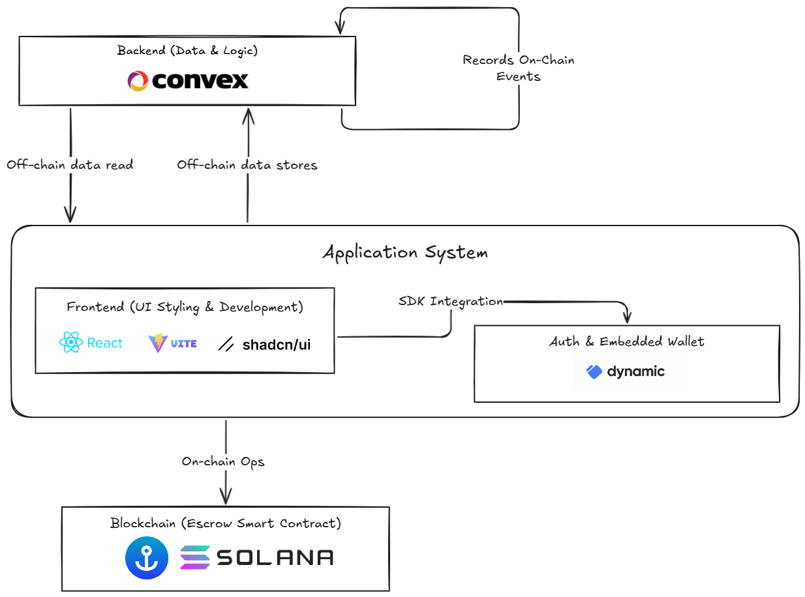

<!--
-->

# **TaniTrack: Technical Deep Dive**

Building a Hybrid Web3 Agricultural Marketplace

---

## Project Overview & Goal

**TaniTrack:** Streamlining agricultural trade by securely connecting farmers and buyers.

**Technical Goal:**

- Combine robust off-chain data management for a rich UX.
- Utilize on-chain financial integrity via Solana for secure transactions.
- Abstract Web3 complexities for non-technical users (farmers).

---

## Technology Stack

- **Frontend:** React, Vite, TypeScript, Shadcn/UI, Tailwind CSS
- **Backend (Off-Chain):** Convex (Real-time Database & Serverless Functions)
- **Blockchain:** Solana (Anchor & Rust for Smart Contracts)
- **Authentication & Wallet:** Dynamic.xyz (Embedded Wallets)
- **Deployment:** Cloudflare Pages (Frontend), Convex Cloud
- **Dev Tools:** VS Code, AI (ChatGPT/Claude), Lovable (template generation)

---

## Key Technical Decisions

- **React + Vite + Shadcn:**
  - Robust and mature frontend tooling
- **Dynamic.xyz:**
  - Simplifies Web3 for non-technical users (e.g., farmers).
  - Robust auth and future potential for gasless transactions.
- **Convex + Solana Hybrid:**
  - **Convex:** Rapid development, real-time UX for off-chain data.
  - **Solana:** Security and trust for financial escrow.

---

## Architecture: The Hybrid Approach

---

<!--
TaniTrack separates concerns for optimal performance, user experience, and security.
- **Convex:** Manages application data, user profiles, listings, off-chain order states.
- **Dynamic.xyz:** Simplifies auth & provides embedded Solana wallets.
- **Solana:** Secures financial transactions via an escrow smart contract.

-->

---

