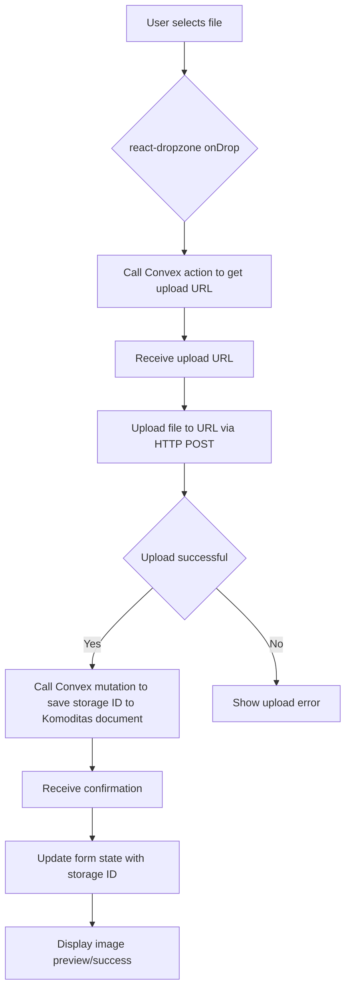

# Image Upload Implementation Plan

**Goal:** Implement image upload functionality for Komoditas using Convex storage and `react-dropzone`.

## Overall Flow

## Actual Implementation: Step 1 (Convex Backend)

1. **`convex/upload_mutations.ts`:**
   - Defines `generateUploadUrl` action using `ctx.storage.generateUploadUrl()`.
   - Defines `saveKomoditasImage` mutation that takes `storageId` and `komoditasId`, and patches the Komoditas document with `imageStorageId`.
   - Defines `getImageUrl` query to get a public URL for a given `storageId` using `ctx.storage.getUrl()`.

## Actual Implementation: Step 2 (Client-side Integration)

1. **`src/components/komoditas/add-komoditas-dialog.tsx` and `src/components/komoditas/edit-komoditas-dialog.tsx`:**
   - Utilize the `KomoditasImageUploadInput` component for handling the image upload UI and logic.
   - Manage the `uploadedStorageId` state to store the ID received after a successful upload.
   - The `handleUploadSuccess` function updates the `uploadedStorageId` state.
   - The `saveImageMutation` (from `convex/upload_mutations.ts`) is called within the `handleAddKomoditas` (in `add-komoditas-dialog.tsx`) and `handleEditKomoditas` (in `edit-komoditas-dialog.tsx`) functions _after_ the Komoditas document is created or updated, passing the `uploadedStorageId` and the Komoditas ID.
   - The `KomoditasImageUploadInput` component likely handles the call to `generateUploadUrl`, the file upload via HTTP POST, and receiving the initial storage ID.
   - The `initialImageUrl` state in `edit-komoditas-dialog.tsx` is used to manage the existing image on edit.
